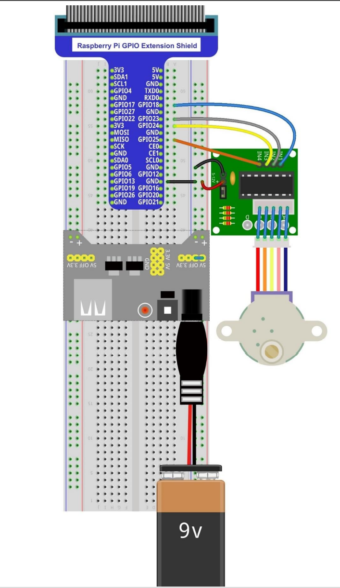

# rPiMotor
A fun dotnetcore project for controlling a motor with a raspberry pi.

when executed this project will rotate a stepper motor until stopped.

This project is used to serve as a dotnet example of the [freenove stepper motor example in c](https://github.com/Freenove/Freenove_Ultimate_Starter_Kit_for_Raspberry_Pi/blob/master/Code/C_Code/16.1.1_SteppingMotor/SteppingMotor.c)

## Wireup

The following diagram shows how the pins are connected to the raspberry pi and the motor.

The following pins are used.

| Pin | Raspberry Pi | Motor |
| ---- | ------------ | ------ |
| 18 | GPIO Pin 18  | Pin 1  |
| 23 | GPIO Pin 23  | Pin 2  |
| 24 | GPIO Pin 24  | Pin 3  |
| 25 | GPIO Pin 25  | Pin 4  |

## Building and Running the Code

In order to build the code in a manner it can be run on the raspberry pi (without installing any additional software) you need to run the following commands:

    dotnet  publish --self-contained true --runtime linux-x64

then copy the resulting files to the a directory of your choosing on the raspberry pi.

Once your files are on the raspberry pi you can run the following command to run the program:

    dotnet run rPiMotor

This will run the turn the stepper motor until you press the `q` (or indeed any other) key. 